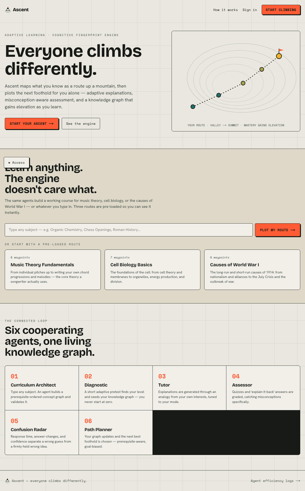
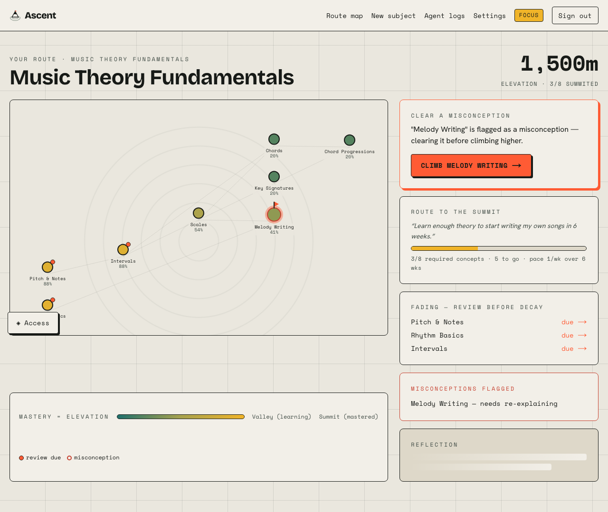
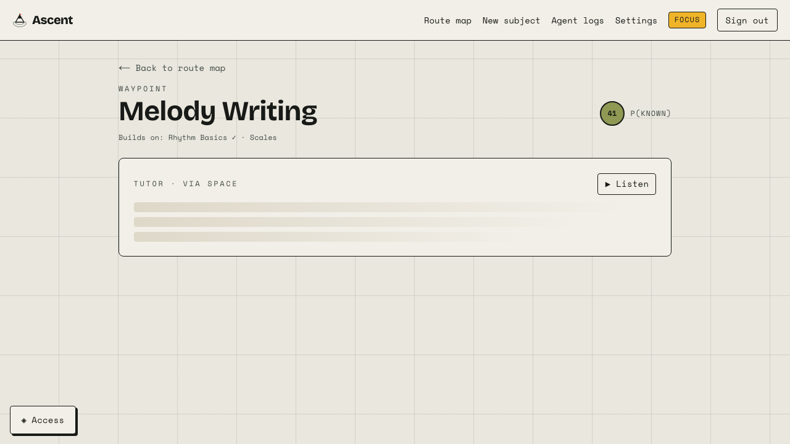
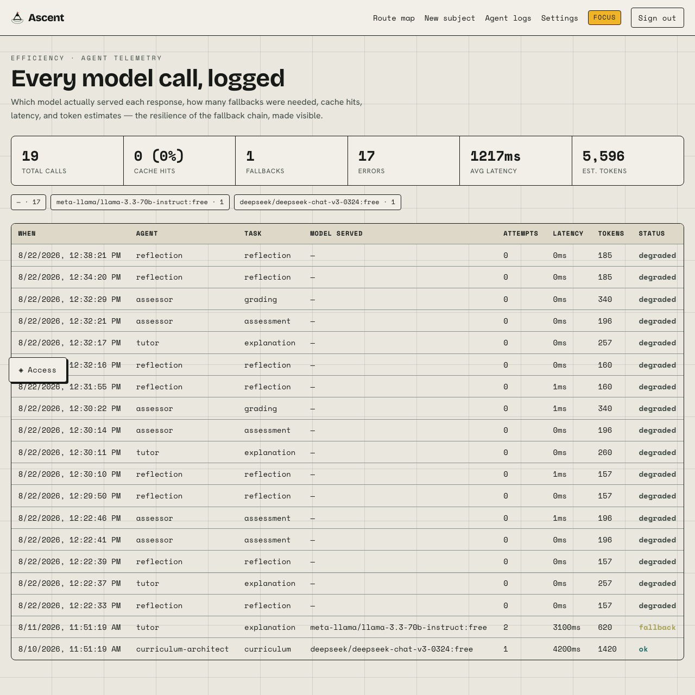

# Ascent

### _Everyone climbs differently._

Ascent is an AI‑powered adaptive learning system that treats what you know as a **route up a mountain**. It builds a living, probabilistic knowledge graph for _any_ subject you type in, then plots the single next best foothold for you alone — with explanations drawn from your own interests, misconception‑aware assessment, and a spaced‑repetition scheduler that resurfaces concepts before they fade.

---

## Test credentials (log in immediately)

| Account | Password | State |
| --- | --- | --- |
| `climber@test.dev` | `summit123` | **Mid‑journey** — Music Theory route already partly ascended (populated knowledge graph, a review due, a flagged misconception). Best for a quick look. |
| `learner@test.dev` | `climbing123` | **Fresh** — no enrolment yet. Best for walking the full onboarding → diagnostic → lesson loop. |

> Passwords are bcrypt‑hashed in the database via the seed script — never stored in plaintext or committed to the repo.

---

## 1. Chosen vertical

Ascent is **subject‑agnostic personalised tutoring** for self‑directed learners — students cramming for an exam, professionals reskilling, or a curious person picking up something brand new. It is deliberately _not_ tied to one syllabus: you type any subject ("Organic Chemistry", "Chess Openings", "Roman History") and the system generates a working course. Three routes come pre‑loaded from deliberately different domains — **Music Theory Fundamentals**, **Cell Biology Basics**, and **Causes of World War I** — to prove the engine is genuinely general and to guarantee a fast, reliable demo.

## 2. Approach and logic — the "Cognitive Fingerprint"

Instead of a grab‑bag of AI features, Ascent is built around one spine: **every learner has a living knowledge graph of concept nodes, each carrying a probabilistic mastery score `P(known)`** updated after every interaction using **Bayesian Knowledge Tracing** (not a flat percentage). The system's entire job is to keep that graph accurate and act on it.

Layered on top, all connected:

- **Diagnostic onboarding** — a short adaptive pretest (IRT‑lite: difficulty tracks your ability estimate in real time) seeds your initial graph so you never start at zero.
- **Analogy Engine** — you pick 2–3 interests; every explanation is generated _through_ that analogy, so two learners on the same concept get genuinely different lessons.
- **Explain‑it‑back (Feynman check)** — you explain a concept in your own words; the Assessor grades accuracy/completeness and returns specific feedback, not "good job".
- **Confusion Radar** — response latency, answer‑changing, repeated attempts, and the **calibration gap** (self‑rated confidence vs. correctness) distinguish a _misconception_ (confidently wrong) from _hasn't‑learned‑yet_.
- **Path Planner** — prerequisite‑aware selection of the next concept (remediate misconceptions → clear due reviews → learn the next unlocked, goal‑biased concept).
- **Forgetting‑curve reviews** — an SM‑2 scheduler resurfaces concepts before predicted decay; the map shows mastery "fading" if unreviewed.
- **Goal reverse‑planning** — state a goal ("write my own songs in 6 weeks") and Ascent reverse‑engineers the required subgraph and a weekly pace, then tracks progress as a route to the summit.
- **Presentation modes** — Explorer / Focus / Mastery change real layout density _and_ the tone/pacing of generated content (agent prompt parameters), not just a CSS class.

### Agent architecture (server‑side, never exposed to the client)

Six cooperating agents, each with a scoped system prompt, orchestrated through one shared, logged LLM client:

| Agent | Responsibility |
| --- | --- |
| **Curriculum Architect** | Any subject/goal → prerequisite‑ordered concept graph + seed diagnostics, validated against a strict schema **and** the engine's graph validator (acyclic, resolvable prerequisites) before acceptance. |
| **Diagnostic** | Administers the adaptive pretest and estimates initial mastery. |
| **Tutor** | Explanation via the Analogy Engine + current mastery + presentation mode (streamed). |
| **Assessor** | Calibrated quiz items; grades free‑text explanations; detects misconceptions. |
| **Path Planner** | Deterministic, unit‑tested next‑concept + due‑review decision over the graph. |
| **Reflection** | Short human‑readable progress summary. |

The **core adaptive decision logic lives in a pure, unit‑tested engine** (`lib/engine`), not in an LLM — so knowledge tracing, scheduling, and next‑concept selection are reproducible and auditable. LLMs generate _content_; math decides _pedagogy_.

## 3. How the solution works — the connected journey

`sign in → onboarding (type any subject → Curriculum Architect) → interests + mode + goal → adaptive diagnostic → route map → lesson (analogy explanation → quiz → explain‑it‑back) → knowledge graph updates → planner re‑routes`

Every step shares real state — the same `P(known)` graph flows through the whole loop. This exact path is covered by an end‑to‑end Playwright test.

**Landing — type any subject, or start a pre‑loaded route**


**Route map — your Cognitive Fingerprint as a topographic climb**


**Lesson — analogy‑driven tutor, quiz, and explain‑it‑back**


**Agent efficiency logs — every model call, logged**


## 4. GenAI services used — OpenRouter with a real fallback chain

All generation goes through **OpenRouter** (`/api/v1/chat/completions`) via a single server‑side client (`lib/ai/client.ts`) — **the API key never reaches the browser**; every call is proxied through a Next.js route/server action.

- **Model roles** (`lib/ai/models.config.ts`): a _reasoning_ chain for the Curriculum Architect, Tutor, and grading; a _fast_ chain for quiz/diagnostic/reflection.
- **Fallback chain**: OpenRouter's free (`:free`) roster **rotates weekly** and is rate‑limited (~20 req/min + a daily cap) — confirmed first‑hand while building this: every model originally hardcoded had rotated out by the time a real key was tested. So no single model is trusted — the client walks an ordered list, retrying the **next** model on any 429 / error / timeout / unparseable‑JSON **or valid‑JSON‑wrong‑shape** (a model can return syntactically valid JSON that doesn't match the expected schema; the client re‑validates against the caller's schema and treats a mismatch as that model's failure, not the whole call's), with capped attempts and exponential backoff. The `/dev/logs` view shows which model _actually_ served each response and how many fallbacks were needed. Run `npm run verify:models` any time to test every currently‑configured model against the live API before a demo.
- **Caching**: identical prompts hit an in‑memory response cache; generated curricula are cached durably in Postgres (`CurriculumCache`) so repeat subjects are instant.
- **Streaming**: the Tutor streams tokens for responsiveness, with transparent fallback to the non‑streaming chain.
- **Prompt‑injection hardening**: all learner text is wrapped in fenced, clearly‑labelled data blocks and sanitised — never concatenated into a system prompt with instruction authority.
- **Graceful degradation**: if the whole chain fails (or no key is set), the app falls back to cached curricula + deterministic static content, so **the demo never shows a broken screen**.

> **Before demo day:** verify current free model IDs at <https://openrouter.ai/models?order=pricing-low-to-high> and reorder `lib/ai/models.config.ts`. The app works even if the top entries are dead, as long as one in the chain is live.

## 5. Assumptions

- **Subject scope for the demo:** three curated subjects are pre‑seeded for reliability; live generation for arbitrary subjects works when an OpenRouter key is set. Without a key, Ascent runs entirely on cached curricula + static fallbacks — the full loop still works.
- Bayesian/IRT/SM‑2 parameters are sensible defaults, not fit to real learner data.
- The diagnostic is short (4–8 adaptive items) by design; mastery refines as you learn.
- One shared `Course` per subject slug; all per‑learner state lives in `Enrollment` / `MasteryState`.

## 6. Local setup

```bash
# Node 20.19+ (Node 22 recommended)
npm install

# Environment
cp .env.example .env.local        # fill in OPENROUTER_API_KEY (optional) + AUTH_SECRET
# Put your Postgres URL in .env (Prisma CLI + seed read .env):
echo 'DATABASE_URL="postgresql://…"' > .env

# Database (Neon or any Postgres)
npm run db:push                   # apply schema
npm run db:seed                   # seed 3 subjects + test accounts
npm run cache:subjects            # (optional) offline‑generate/validate the 2 extra subjects
npm run verify:models             # (optional) test every configured model against the live API

npm run dev                       # http://localhost:3000
```

No OpenRouter key? Leave it blank (or set `ASCENT_OFFLINE_FALLBACK=1`) and the app runs on the cached curricula + static fallbacks. With a key, verified live end‑to‑end: live curriculum generation for brand‑new subjects, streamed tutor explanations, live quiz generation, and live Feynman grading (which correctly caught a deliberately‑planted misconception in testing) — see `/dev/logs` for real model attribution.

## 7. Vercel deployment

1. Push to GitHub and import the repo in Vercel.
2. Set env vars in Vercel project settings: `DATABASE_URL`, `AUTH_SECRET`, `OPENROUTER_API_KEY`, `OPENROUTER_APP_URL` (your deployed URL). Use a pooled Neon connection string.
3. Build command `next build` (default). Run `npm run db:push && npm run db:seed` once against the production DB.
4. Verify the **production** build and the live AI routes on the deployed URL before recording — env‑var and streaming issues surface in prod, not `next dev`.

## 8. Testing

- **Unit** (Vitest): Bayesian Knowledge Tracing update, SM‑2 scheduler + forgetting curve, graph validation/topo‑sort/elevation, IRT‑lite diagnostic, Confusion Radar classification, path‑planner next‑concept selection, goal reverse‑planner.
- **Integration** (Vitest): the OpenRouter **fallback chain** (429 → next model, all‑fail, cache hit, bad‑JSON retry, offline), Curriculum Architect schema+graph validation, the `/api/register` route, and the rate limiter.
- **End‑to‑end** (Playwright): the entire connected journey against a production build — sign in → onboarding → adaptive diagnostic → route map → lesson → quiz → explain‑it‑back → graph updates (`e2e/journey.spec.ts`). A second spec (`e2e/live-subject.spec.ts`) walks the same loop for a brand‑new, never‑cached subject typed at runtime, proving the live Curriculum Architect path through the real UI end‑to‑end. Plus an **axe‑core** WCAG audit that fails on serious/critical violations.

```bash
npm test                # unit + integration
npm run test:coverage   # coverage report
npm run test:e2e        # Playwright (starts a production server automatically)
```

**Coverage:** core engine ~90% statements, AI client ~94%; overall unit/integration ~73% (agent wrappers + streaming are exercised by the e2e). The full pedagogical decision path is covered by pure unit tests.

## 9. Accessibility & security notes

**Accessibility (WCAG 2.1 AA):** semantic landmarks and heading hierarchy; visible focus rings on every interactive element; full keyboard navigability; a skip link; `prefers-reduced-motion` respected _and_ an in‑app toggle; a dyslexia‑friendly font toggle and font‑scaling that don't break layout; Web Speech narration of explanations; colour tokens chosen for AA contrast (dark text on the survey‑orange accent). An automated **axe‑core** audit runs in CI (`e2e/a11y.spec.ts`) and fails on serious/critical issues.

**Security:** API keys are server‑side only (never in the client bundle); every API route validates input with **Zod**; real auth (Auth.js Credentials) with **bcrypt**‑hashed, seeded test accounts; **rate limiting** on AI‑calling and auth‑adjacent routes; user text sanitised (and React auto‑escaping) to prevent XSS; **Prisma** ORM only (no string‑concatenated SQL); CSP + `X-Frame-Options` + HSTS and other security headers via `next.config.ts`; `.env*` gitignored with a committed `.env.example`.

---

## Architecture at a glance

```
app/                 Next.js App Router — pages + API routes (Zod‑validated, rate‑limited)
lib/engine/          Pure, unit‑tested: BKT, SM‑2, graph, IRT diagnostic, confusion radar, planners
lib/ai/              OpenRouter client (fallback + cache + logging), schemas, 6 agents, fallbacks
lib/                 courses, enrollment, mastery, session, rate‑limit, sanitize helpers
prisma/              schema + seed (3 subjects + test accounts + mid‑journey learner)
scripts/             offline curriculum generation (cache:subjects)
tests/               Vitest unit + integration
e2e/                 Playwright journey + axe‑core a11y + screenshot capture
```

Built for the "Prompt Wars" hackathon. Design direction: **Topographic Cartography** — learning as a survey route up a mountain, mastery as elevation gained.
